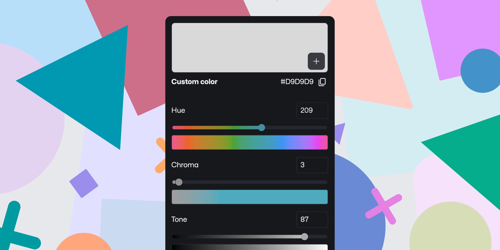

# HCT (Hue, Chroma, Tone) color picker for Figma

This color picker uses Google's HCT logic to pick, change, and add colors and styles.

Select elements in the document and change their colors in real time.

## Features

- Select elements in the document and change their colors in real time.

- Add new styles to the document's styles palette.

- Change the color of the selected element.

## Installation

1. Go to the [plugin page](https://www.figma.com/community/plugin/1227923985322908257/HCT-Color-Picker)
2. Click "Try it out".

## Contributions and issues

Please feel free to open issues and pull requests.

Please follow the [Conventional Commits](https://www.conventionalcommits.org/en/v1.0.0/) standard.

## Development

1. Clone the repo
2. Run `yarn install`
3. Run `yarn nx run @mordech/hct-color-picker:watch`
4. Open Figma and go to Plugins > Development > Import plugin from manifest
5. Select the `manifest.json` file in the `/apps/hct-color-picker/dist/` folder
6. The plugin should now be available in the Plugins menu

### Components

The plugin uses [my web component library](/packages/web-components/) to build the UI. If you want to contribute to the UI, follow the instructions in the [web components README](/packages/web-components/README.md).

## Build

1. Run `yarn nx run @mordech/hct-color-picker:build` to build the plugin
2. The plugin will be available in the `/apps/hct-color-picker/dist/` folder

## Contribution guidelines

## License

[GPL-3.0](LICENSE)

Made with ❤️ by Mordech
