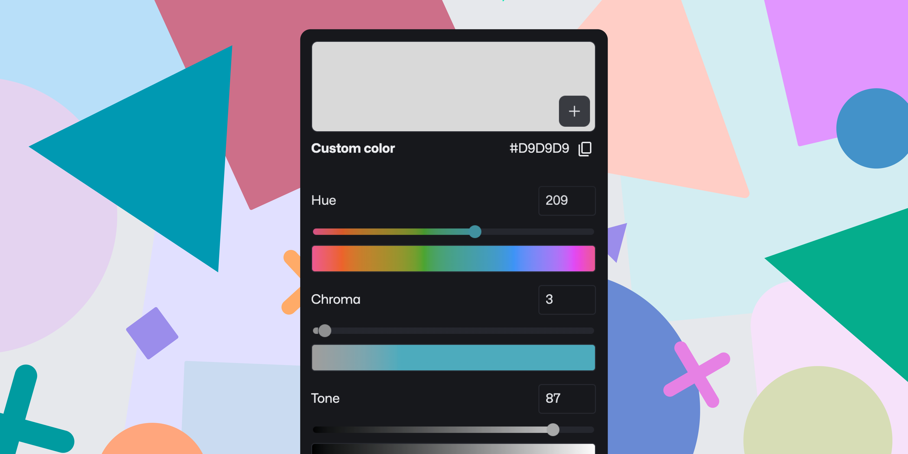

# HCT (Hue, Chroma, Tone) color picker for Figma

[
](https://www.figma.com/community/plugin/1227923985322908257/hct-color-picker)

This color picker uses Google's HCT logic to pick, change, and add colors and styles.

Select elements in the document and change their colors in real time.



## Features

- Select elements in the document and change their colors in real time.

- Add new styles to the document's styles palette.

- Change the color of the selected element.

- Control the alpha (opacity) of colors with the dedicated alpha slider.

## Installation

1. Go to the [plugin page](https://www.figma.com/community/plugin/1227923985322908257/HCT-Color-Picker)
2. Click "Try it out".

## Contributions and issues

Please feel free to open issues and pull requests.

Please follow the [Conventional Commits](https://www.conventionalcommits.org/en/v1.0.0/) standard.

## Development

1. Clone the repo
2. Run `yarn install`
3. Run `yarn workspace hct-color-picker watch`
4. Open Figma and go to Plugins > Development > Import plugin from manifest
5. Select the `manifest.json` file in the `/apps/hct-color-picker/dist/` folder
6. The plugin should now be available in the Plugins menu

### Components

The plugin uses [my web component library](/packages/web-components/) to build the UI. If you want to contribute to the UI, follow the instructions in the [web components README](/packages/web-components/README.md).

## Build

The build has two targets that run concurrently:

- **UI** (`build:ui`) — Vite bundles the iframe UI from `ui-src/`
- **Plugin** (`build:plugin`) — esbuild bundles the Figma sandbox code from `plugin-src/` to `dist/code.js`

Run both together:

```bash
yarn workspace hct-color-picker build
```

## Contribution guidelines

Please follow the [Conventional Commits](https://www.conventionalcommits.org/en/v1.0.0/) standard and open an issue before submitting large changes.

## License

[GPL-3.0](LICENSE)

Made with ❤️ by Mordech
